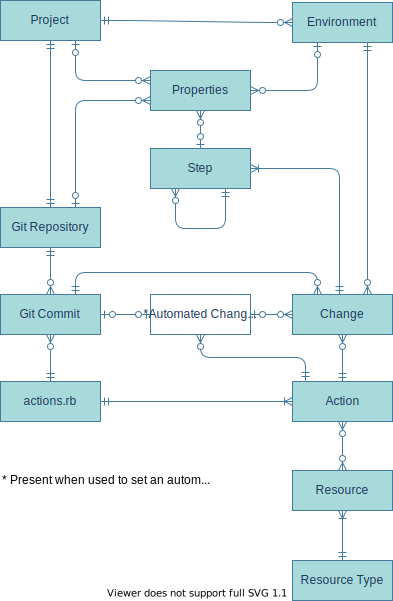

# OpsChain concepts

There are several key OpsChain concepts that are useful to comprehend in order to understand the tool and its uses.

  

## Project

Projects are used to organise environments and changes - a project contains many [environments](#environment), and [changes](#change) can be applied to these environments. Each project has

- a Git repository containing configuration for that project
- [properties](properties.md) where you can store project specific:
  - key value pairs
  - environment variables and values (that will be available in the Unix environment running a change action)
  - files (that will be written to the working directory before running a change action)

## Environment

Environments represent the logical infrastructure environments under a [project](#project) (for example Development or Production). Environments also have an associated set of encrypted [properties](properties.md). If a property exists at project and environment level, the environment value will override the project value.

## Change

A change is the application of an action from a specific commit in the project's Git repository, to a particular project environment.

See the OpsChain [change reference guide](changes.md) guide for more information.

### Change & step lifecycle

Changes, and the steps that make them up, transition between states as they execute.

Changes are created in the `pending` state and are in this state until they start execution. A change stays in the `pending` state while waiting for any existing changes in the same environment to finish. A step stays in the `pending` state until its prerequisites are complete. If a prerequisite step fails any dependent steps will remain in the `pending` state and will not transition further.

When a change starts executing it enters the `queued` state. Changes and steps stay in the `queued` state while they are waiting for an OpsChain worker to start executing them (e.g. if all workers are already busy).

Whilst a change or step is actively executing it is in the `running` state.

If the change/step succeeds it transitions to the `success` state. If the change/step fails it transitions to the `error` state.

If a change is cancelled by a user all finalised steps (i.e. in the `success` or `error` state) remain in their existing state, and all `pending`, `queued`, or `running` steps are transitioned to the `cancelled` state. There is no rollback of any kind, steps that have not yet started will not start, and steps that are in progress are stopped immediately.

#### Behaviour when a child step fails

Configuring a step's children to run sequentially or in parallel not only impacts how they are executed but also effects how OpsChain processes them if any fail. If a child step fails:

- _Sequential:_ OpsChain terminates the change at the completion of the failed child step and any remaining steps will not run
- _Parallel:_ OpsChain allows all siblings of the failed child step to complete and then terminates the change

Note: The change status will transition to `error` when OpsChain terminates the change.

#### Retrying changes

Changes that have failed or been cancelled can be retried.

When retrying a change, the existing change is duplicated as a new change and started from where the existing change ended. Any successfully completed steps are not rerun - they will stay in the `success` state with their original started and finished times. Steps that were being run by a worker when the change ended are restarted from the start as OpsChain does not track step internals.

As steps are rerun from the start we suggest only retrying changes/steps that are idempotent.

_Notes:_

1. _When OpsChain retries a change, it will retry it using the code from the Git sha stored with the original change. If you wish to retry an action using updated project Git repository code, a new change must be created to specify the new Git sha._
2. _The logs for the original change are not included when using the `show-logs` command. They can still be seen in the original change._

## Automated change rule

An automated change rule allows the automated creation and execution of a change.

Automated change rules can be configured to automatically create and deploy changes in an environment:

- at a particular time
- in response to project Git repository updates

See [setting up automated changes](automated_changes.md) for a guide on how to create an automated change rule.

## Action

An action is a task that can be performed (for example provisioning or restarting a server). Actions can have prerequisites that will run before and steps that will run after the main action has completed.

The logic for an action can be provided directly within the action definition, or if the action forms part of a Resource, it can call logic within its associated controller.

See the [actions reference guide](actions.md#defining-standalone-actions) and [developing your own resources guide](/docs/getting_started/developer.md#developing-resources/) for more information.

## Resource

A resource represents something that OpsChain can perform actions on (e.g. SOA Instance, Confluent Broker, Linux Host, etc.) and is an instance of a resource type. A resource may include:

- A controller class that will provide logic for some (or all) of the resource actions
- Any number of resource properties. These are key value pairs that can be referenced in the action code and are supplied as a hash to the controller's constructor
- Any number of action definitions, allowing you to define actions that can be performed on the resource

See the [actions reference guide](actions.md#defining-resource-types--resources) and [developing your own resources guide](/docs/getting_started/developer.md#developing-resources) for more information.

## Resource type

A resource type is a template for creating resources. Rather than duplicating the definition for each instance of a resource, the controller, resource properties and action definitions can be defined in the resource type and automatically configured when the resource is created.

See the [actions reference guide](actions.md#defining-resource-types--resources) and [developing your own resources guide](/docs/getting_started/developer.md#developing-resources) for more information.

## Composite resource

A composite resource is a resource that encapsulates child resources. An example of this is the Confluent broker composite defined in the [resource types](https://github.com/LimePoint/opschain-examples-confluent/blob/master/lib/confluent/resource_types.rb) used in the [Confluent example](../../examples/running_a_complex_change.md). The Confluent broker composite provides the definition of the resources required to create one or more child brokers. Each broker will have a host, Java installation, Confluent installation and broker definition.

Composite resources also allow you to define actions that will apply to all the composite's children. The Confluent broker composite in the example defines three actions (configure, start and install). Executing any of these actions on the composite will execute the equivalent action on each of the child brokers.

See the [actions reference guide](actions.md#defining-composite-resources--resource-types) and [developing your own resources guide](/docs/getting_started/developer.md#developing-resources) for more information.

## Project Git repository

See the [OpsChain project Git repositories](../project_git_repositories.md) guide for more information.

## Git remote

Project Git repositories use [Git remote](https://git-scm.com/book/en/v2/Git-Basics-Working-with-Remotes) to access centralised repositories (e.g. on GitHub or Bitbucket) to allow teams to develop and manage their OpsChain configuration together.

See the [Git remotes guide](git_remotes.md) for more information.

## Properties

The configuration properties used for changes - stored in an auditable and secure manner.

See the [OpsChain properties](properties.md) guide for more information.

## Step

A step is a unit of work that is run by an OpsChain worker. A step typically runs a single action that may have its own prerequisites and child steps.

## Step runner image

All steps are executed within isolated containers. The step runner image is the base image used for the step containers.

If a custom step runner image (`.opschain/Dockerfile`) is not used, then a default step runner image is created including the project Git repository at the relevant Git revision.

See the [OpsChain step runner](step_runner.md) guide for more information.

## Step context

The step context can be used within the actions.rb and includes information about the current running change. It can be interacted with in a similar manner to [properties](#properties), but the values are automatically populated by OpsChain.

See the [OpsChain step context](context.md) guide for more information.

## Controller

A controller is a ruby object that can be configured via properties and provides the logic for completing different actions. A controller class must have:

- an `initialize` method that accepts a hash containing different properties
- one or more action methods (these do not accept parameters)

An example controller is shown in the [actions reference guide](actions.md#controller).

## Event

OpsChain tracks the events performed as part of the OpsChain system.

See the [OpsChain events](events.md) guide for more information.

## Licence & authors

- Author:: LimePoint (support@limepoint.com)

See [LICENCE](/LICENCE.md)
